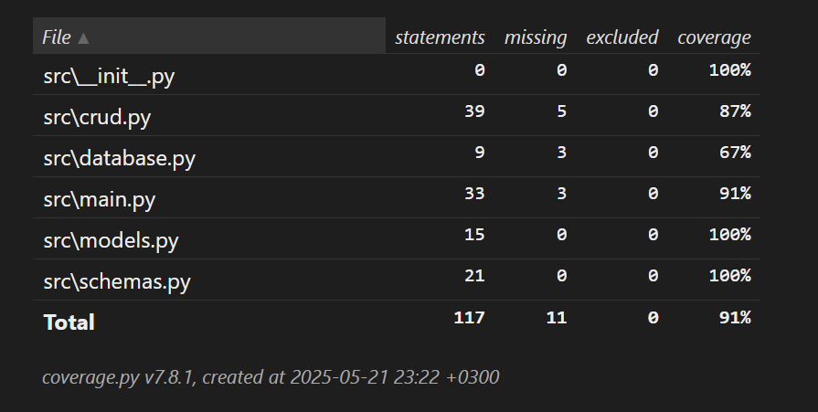
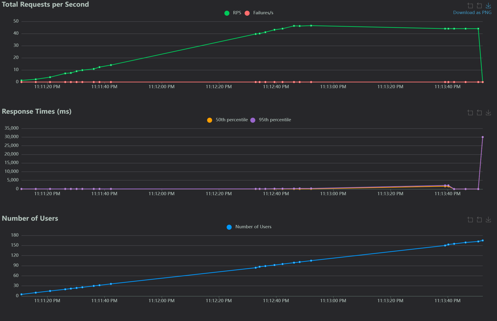

# Тестирование

## Запуск тестов

(конфигурируете venv или используете глобальный)
```bash
pytest
```
Больше ничего не нужно, в корне лежит конфиг для pytest

Результат в формате html страницы лежит в папке [htmlcov](htmlcov)



## Нагрузочное тестирование

